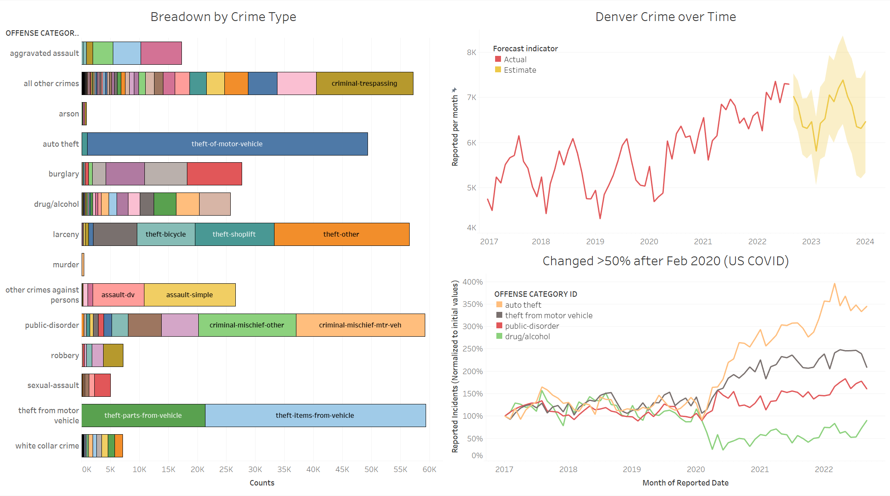
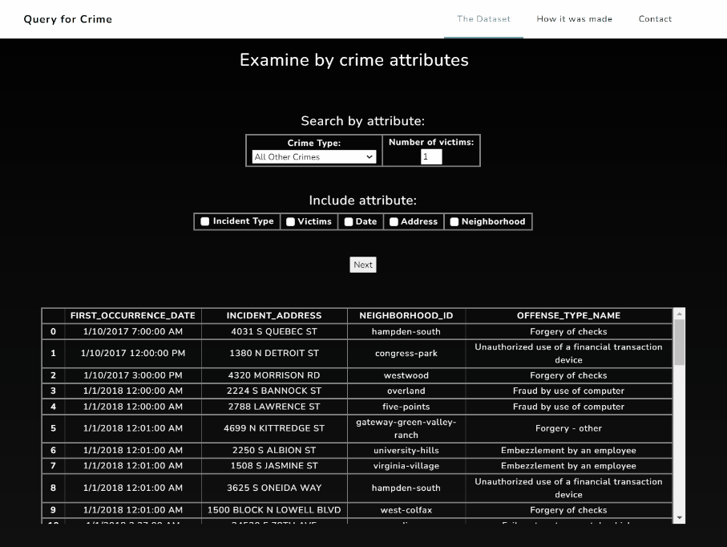
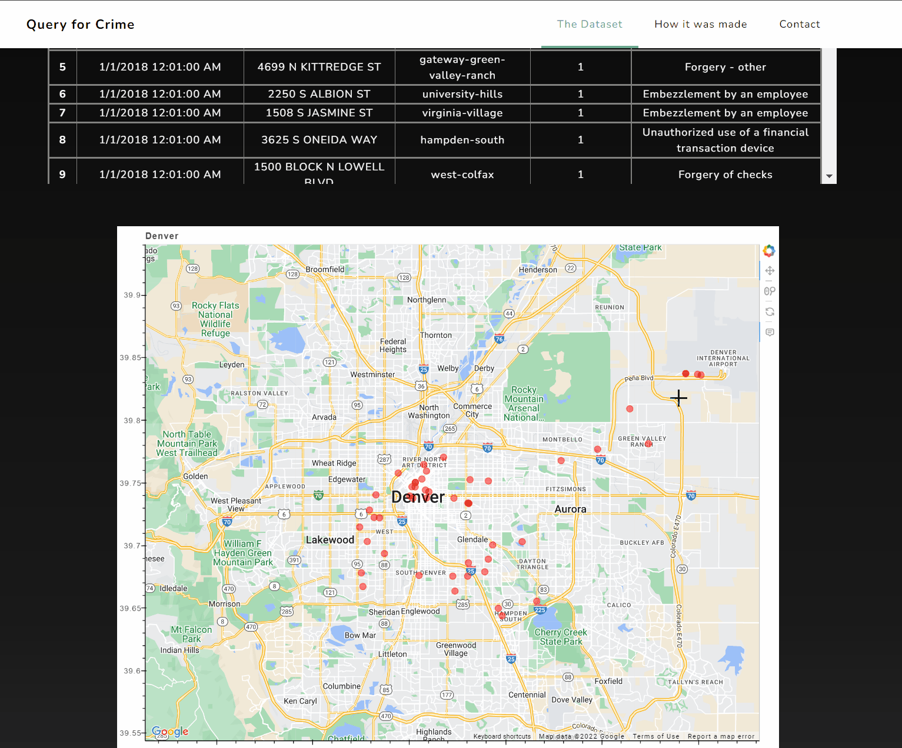
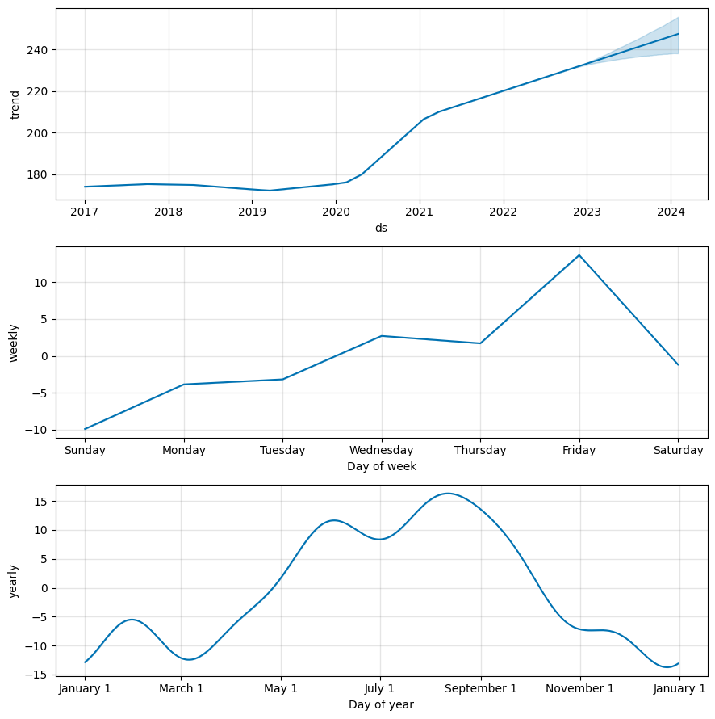
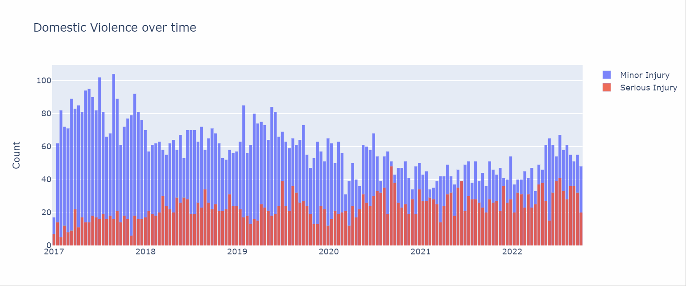

<b><h1>Denver Crime</h1></b>

 

 

 

<b><h2>Why this project?</h2></b>

Denver Crime initially started as a small, hobby project with <b>Flask, JavaScript, MongoDB, and Python</b> to showcase interactive queries, data visualization, and basic forecasting [(skip to section)](#forecasting) using Holt-Winters exponential smoothing and additive nonlinear regression models (explanation on the latter below, also see [Prophet model publication](https://www.tandfonline.com/doi/abs/10.1080/00031305.2017.1380080?journalCode=utas20)).    Denver Crime then grew due to interest from friends in local law-enforcement.  It is currently being tested with Vue.js.  

 

<b>Quick visualization of the dataset</b> 
 

 

<b><h2>The Dataset</h2></b>
Denver Crime takes nearly 400,000 of <a href = "https://www.kaggle.com/datasets/paultimothymooney/denver-crime-data"> DenverPD's recorded incidents </a> from 2017 to 2022, and stores them in a NoSQL database.  Users can make queries through a web form to return query results, which are presented as tables and visual/interactive elements.  

 

<b>Making an incident query by crime type</b>  
 

 

<b><h2>What does it do? </h2></b>
With the intent of making a full-stack testbed that I could easily repurpose for more complex projects in the future, I had to structure/OOP carefully.  I started by:
1. Extracting Crime data and Offense Codes from CSVs and inserting parsed data into a NoSQL DB using <b>MongoDB</b> using <b>PyMongo</b>.
2. Using <b>Flask</b> and <b>MongoDB Query Language (MQL)</b> for form-based queries and table outputs (with more query types and analyses to come).
3. Conducting higher-level analyses in Python (i.e. average time between specified crime types, time windows with the most crime, areas with the most crime types). 
4. Forming interactive visualizations of incidents (maps with tooltips, so far) on user queries using <b>Bokeh</b>.
*Initial CSS styling and layout were provided via <b>Bootstrap</b> and [<b>Grayscale</b>](https://github.com/StartBootstrap/startbootstrap-grayscale).

 

<b>Mapped query results (red dots), and tooltip information from database on mouse-over of each incident</b> 
 

 

<b><h2 id="forecasting">Note on forecasting models</h2></b>

It seems reasonable to apply forecasting models which well-accommodates <b>seasonality</b>--both exponential smoothing and Prophet (additive nonlinear regression) do so.  We can see seasonality is accommodated by Prophet (as a periodic Fourier term) in its general mathematical model:

where represents the nonperiodic trend, represents the periodic (seasonal) component, and represents a normally distributed error term.  Seasonality may occur daily, weekly, monthly, and/or yearly.  Other seasonalities and events such as holidays are accommodated may be accounted for by Prophet as well.  
We see such seasonalities in Denver Crime, and the most apparent are weekly and yearly seasonalities: Fridays and Summer/early Fall tend to have the highest reported incidences of crime.  Indeed, even the onset of the COVID pandemic in the US seems to have had little effect on the seasonality of crime.  However, the general (non-periodic) trend in reported crimes appears to be distinctly positive.  
Lastly, in the context of policy-making, it is important to be able to form and test hypotheses on trends to <i>determine causative effects</i> (correlation does not imply causation).  To test an independent variable for causative effect, we would need to control for all other variables which may affect the outcome.  These variables may include the weather, quarantine lockdowns, and even the price of cars and car parts (Denver has seen a ~300% increase in the rate of auto theft). 

 

<b>Denver Crime Forecast for 2023</b> 
 

 

 

<b>Seasonal (periodic) components in Crime Forecast </b> 
 

 

 <i>Negative components are part of the <a href=#forecasting>additive model</a>. Forecasts generated with the <a href=https://www.tandfonline.com/doi/abs/10.1080/00031305.2017.1380080?journalCode=utas20>Prophet model</a>.</i>

<!-- 

 
<b>Figure 2. Selecting type of crime to examine.</b>  

  -->
<!-- 
 

<b>Query results for "White Collar Crime"</b> 
 
 

  -->

<b><h2>Challenges?</h2></b>
* Some incidents within the original dataset seem binned into a specific day (i.e., there are dozens of incidents occuring on midnight, January 1, 2018).  This needs to be taken into account if time analysis for certain phenomena (i.e. "crime-waves"), thought it has less of an impact on certain calculations such as mean time between incidents.
* <b>PostgreSQL</b> would have also been perfect for this project (though I may be biased due to familiarity with Postgres).  The rationale for using MongoDB was to perform higher-level queries in MQL, and with the new $lookup function, inner/left/outer multi-attribute joins were easy to implement and fast to execute!
 

 

<b>Query Results over Time in Plotly</b> 
 

 

<b><h2>What's left?</h2></b>
1. Integrating [Denver City's address database](https://www.denvergov.org/opendata/dataset/city-and-county-of-denver-addresses) for additional incident address information (building type: apartment, etc.).  A business address database is also available for further locational information. 
2. Additional inferences:
 * "Crime waves": Time-clustered incidences of crime.
 * "Crime hotspots": Spatially-clustered incidences of crime, based on GPS coordinates. 
 * "Crime hotspots over time": A visualization of crime hotspots over time.
 * "Risky buildings": A simple inference on building types with the highest incidences of crime.
3. Implementation of Vue.js elements.
4. Containerization and deployment to AWS using Docker.

