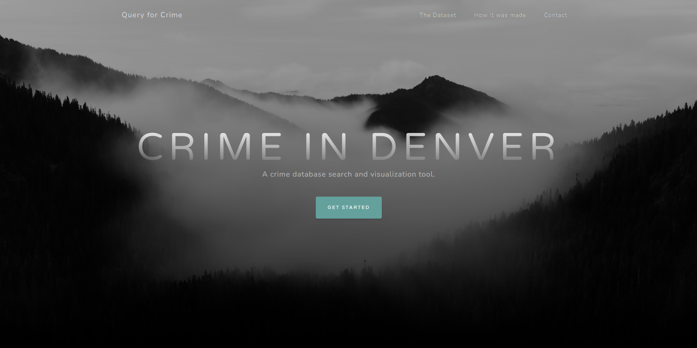
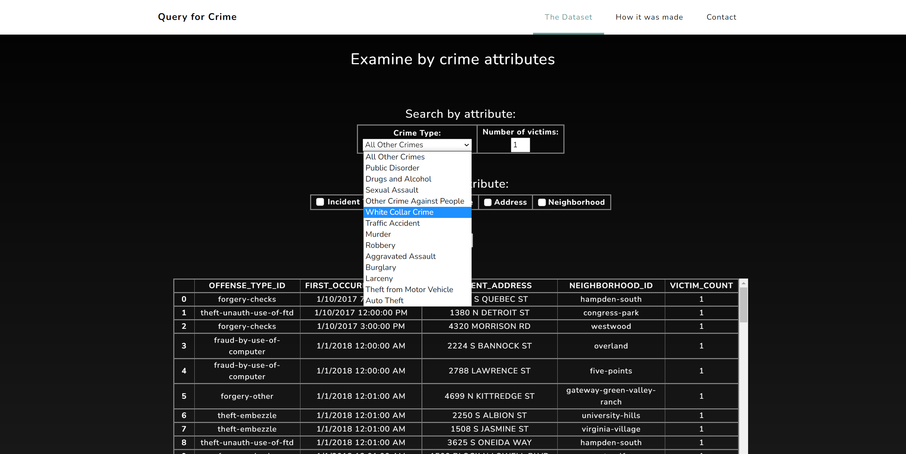
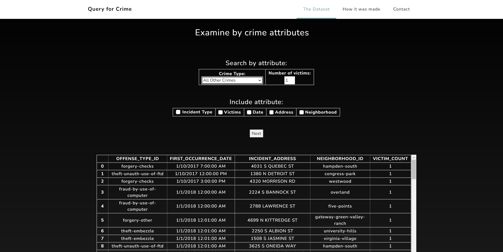

## Denver_Crime

 

 
<b>Figure 1. Home page for Denver Crime.</b>  

 

<h2>Project Outline</h2>

Denver_Crime initially started as a small hobby project with a <b>Flask, JavaScript, MongoDB, and Python</b> stack, and grew due to interest from friends in local law-enforcement.  The front end is currently being tested with Vue.js.

<b><h3>1. Introduction</h3></b>
The purpose of Denver_Crime is to take [DenverPD's publicly available crime data](https://www.kaggle.com/datasets/paultimothymooney/denver-crime-data) from 2017 to 2022, and make it queriable with interactive elements.    

<b><h3>2. Progress</h3></b>
1. Denver crime data, as well as offense codes, were injected, then queried from <b>MongoDB</b> using <b>PyMongo</b>.
2. <b>Flask</b> and <b>MongoDB Query Language (MQL)</b> were used for custom form-based queries and table outputs (more to come!).
3. Various higher-level analyses (i.e. average time between specified crime types, time windows with the most crime, areas with the most crime types). 
4. Initial CSS styling and layout was provided via <b>Bootstrap</b> and [<b>Grayscale</b>](https://github.com/StartBootstrap/startbootstrap-grayscale).  This provided an expedient path to our MVP, and a way to quickly validate our previous work.  

 

 
<b>Figure 2. Selecting type of crime to examine.</b>  

 

<b><h3>3. Thoughts</h3></b>
* Some incidents within the original dataset seem binned into a specific day (i.e., there are dozens of incidents occuring on midnight, January 1, 2018).  This needs to be taken into account if time analysis for certain phenomena (i.e. "crime-waves"), thought it has less of an impact on certain calculations such as mean time between incidents.
* <b>PostgreSQL</b> would have also been perfect for this project (though I may be biased due to familiarity with Postgres).  The rationale for using MongoDB was to perform higher-level queries in MQL.

 

 
<b>Figure 3. Query results for "White Collar Crime".</b>  

 

<b><h3>4. Future work</h3></b>
1. Integrating [Denver City's address database](https://www.denvergov.org/opendata/dataset/city-and-county-of-denver-addresses) for additional incident address information (building type: apartment, etc.).  A business address database is also available for further locational information. 
2. Additional inferences:
 * "Crime waves": Time-clustered incidences of crime.
 * "Crime hotspots": Spatially-clustered incidences of crime, based on GPS coordinates. 
 * "Crime hotspots over time": A visualization of crime hotspots over time.
 * "Risky buildings": A simple inference on building types with the highest incidences of crime.
3. Implementation of Vue.js elements.
4. Interactive visualization of incidents on a map of Denver.
5. Containerization and deployment to AWS using Docker.